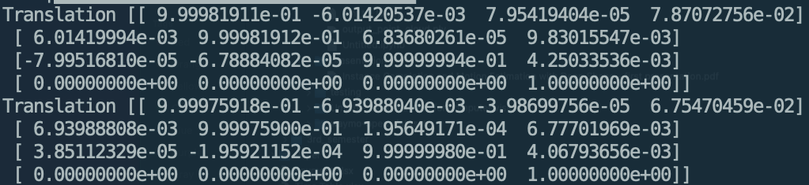

How to run
1. pip3 uninstall kiss-icp
2. cd kiss-icp/python
3. pip install --verbose .
4. kiss_icp_pipeline --visualize /data/

in python/kiss_icp/kiss_icp.py line 69

kiss_icp_pipeline --visualize /data/
python3 kiss_icp/tools/cmd.py --visualize ../data/
